<h1>Welcome to Sports News Website</h1>
live at https://sanjoysutradhar.github.io/sports-news-blog-clone/index.html
<h4>This is implemented by fully using php object oriented concept</h4>
<h4>There have <a href="#admin">Admin Panel</a> And <a href="#user">User Panel</a></h4>

There are Five classes:

<ol>
    <li>Auth(users)</li>
    <li>Blog</li>
    <li>Category</li>
    <li>Comment</li>
    <li>Message</li>
</ol>

Admin role:

<ul>
    <li>CRUD operation of Blogs</li>
    <li>CRUD operation of Categorys</li>
</ul>

Users role:

<ul>
    <li>Create and Update operation of him/her profile</li>
    <li>Create and Update operation of him/her comments in every blogs</li>
    <li>Everyone can send Message to authority</li>
</ul>

<h5 id="user">User Panel</h5>

Home page

Home page with sign in

Detail page

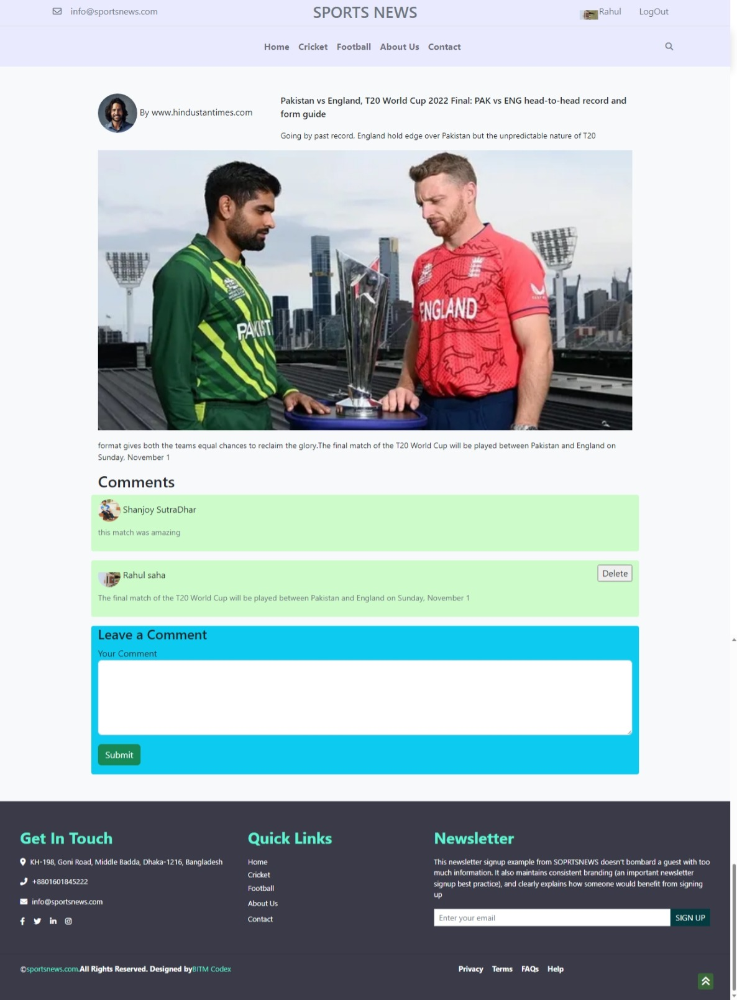

Cricket Category page

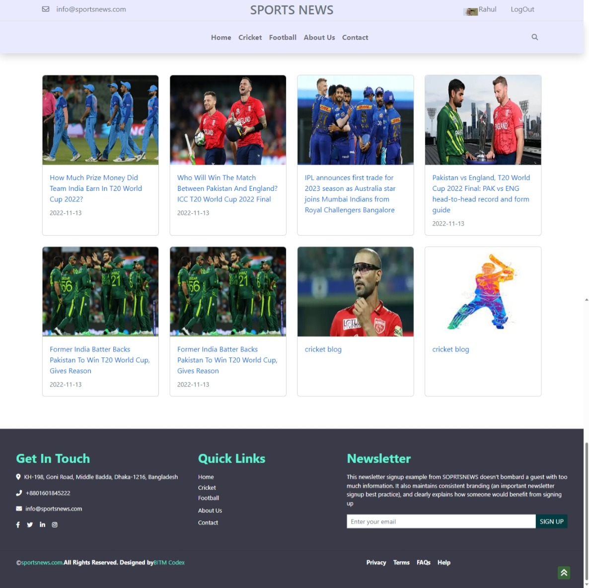

Football Category page

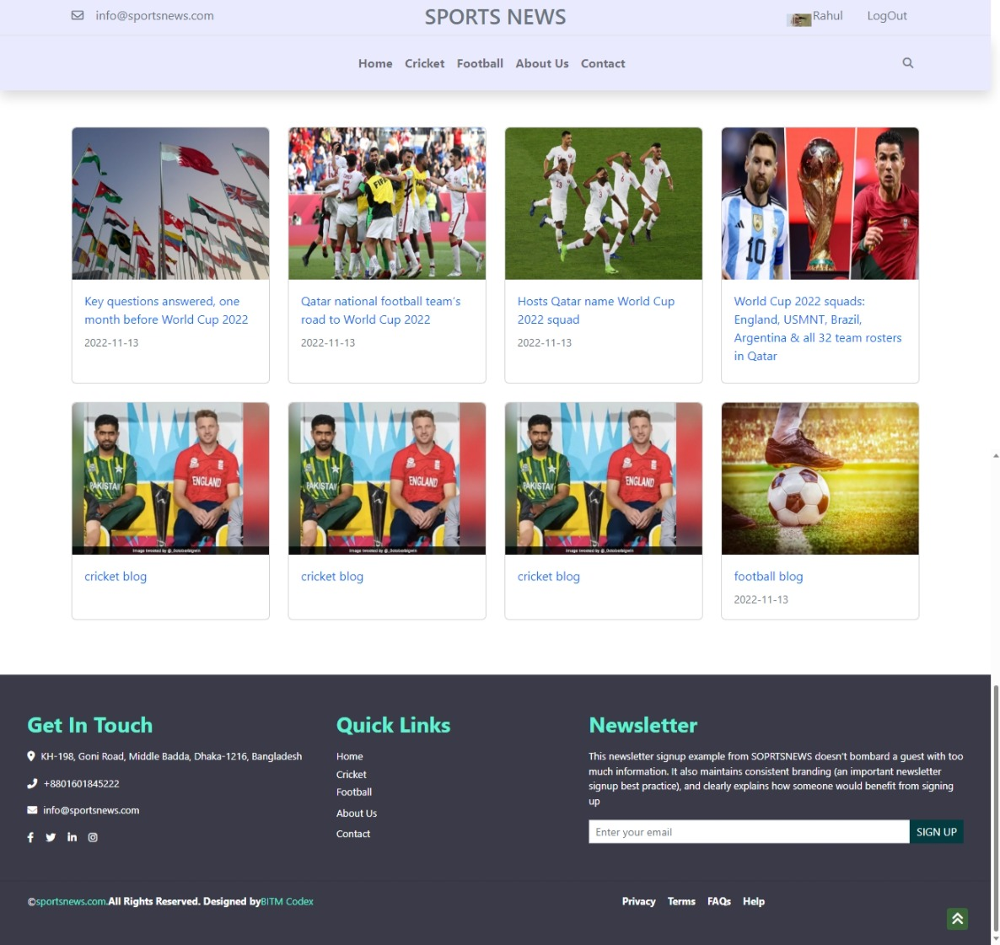

Dashboard page

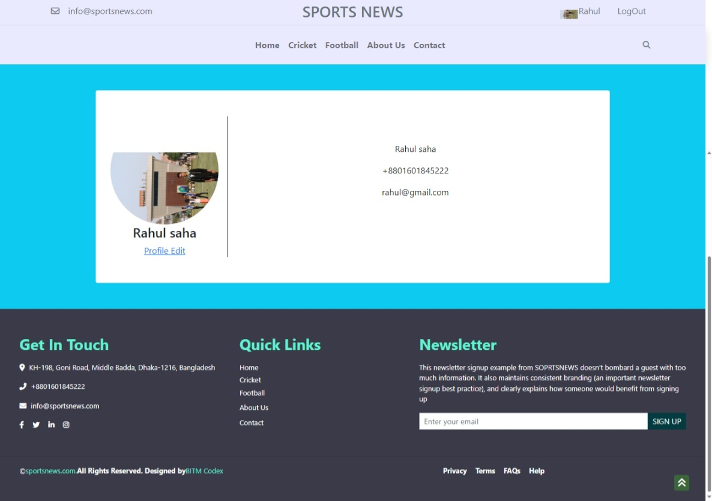

Profile Update page

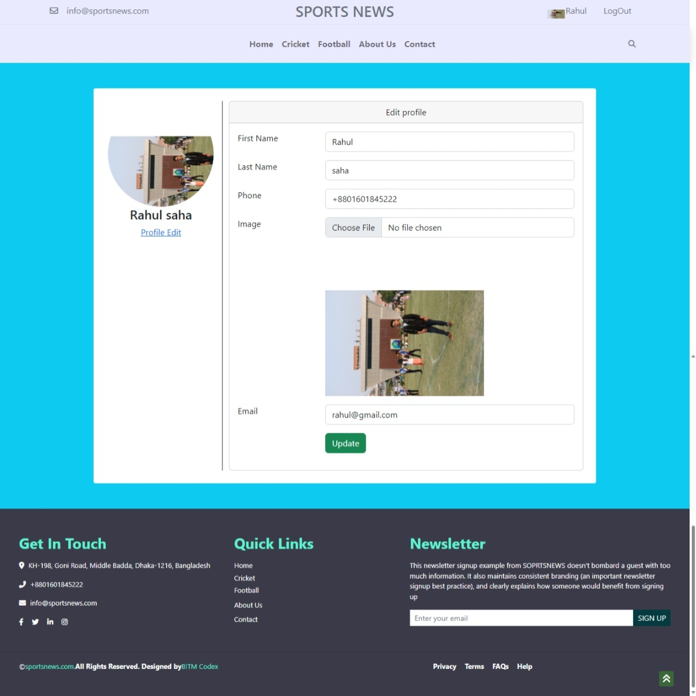

About us page

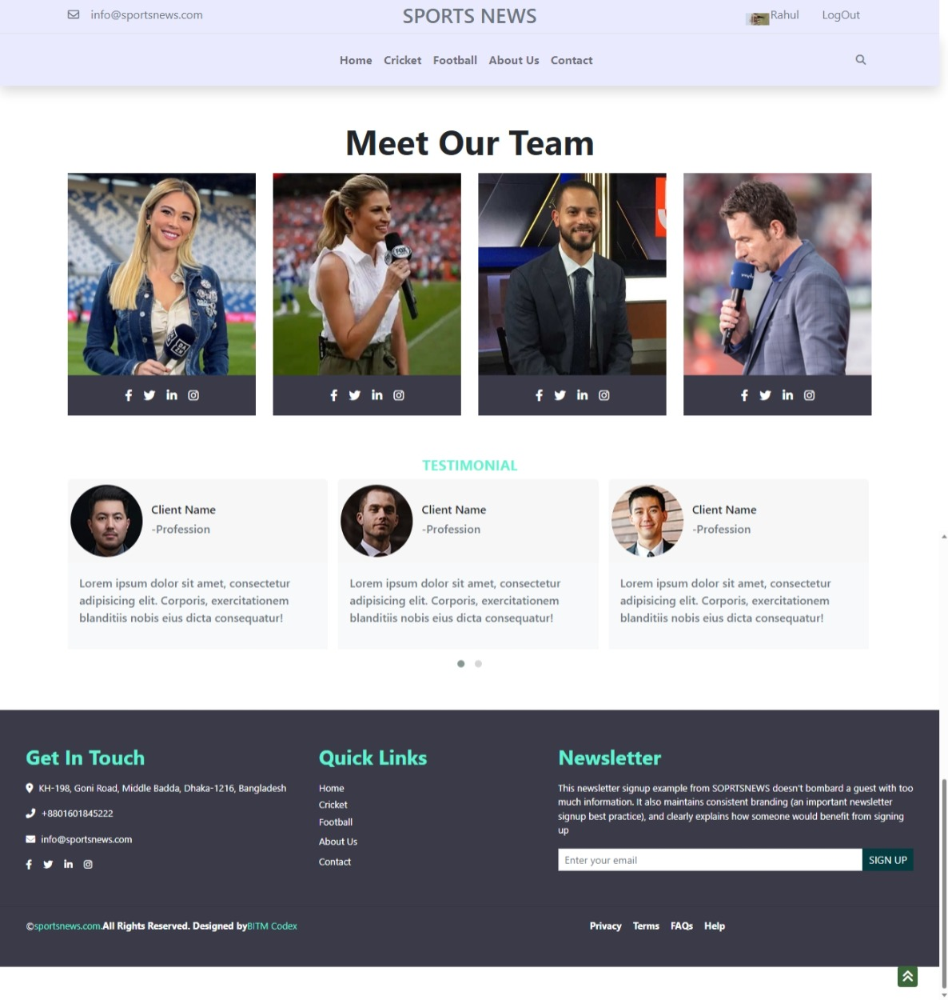

Contact page

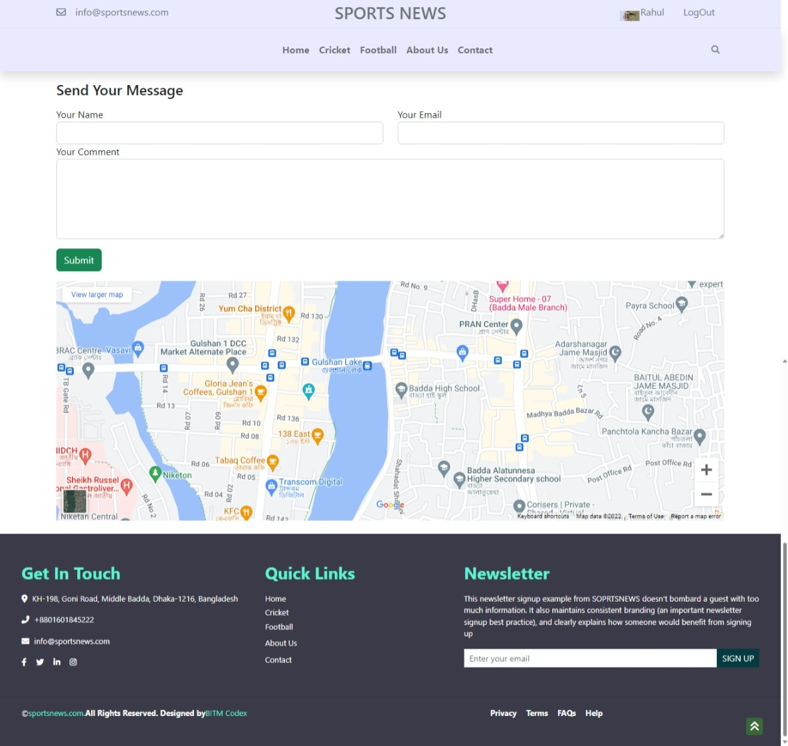

<h1 id="admin">User Panel</h1>

admin home page

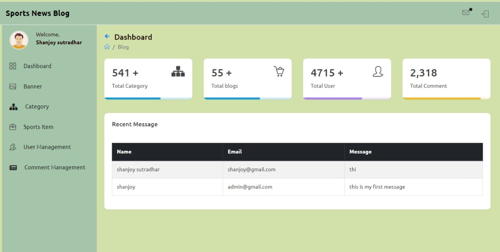

Category create  page

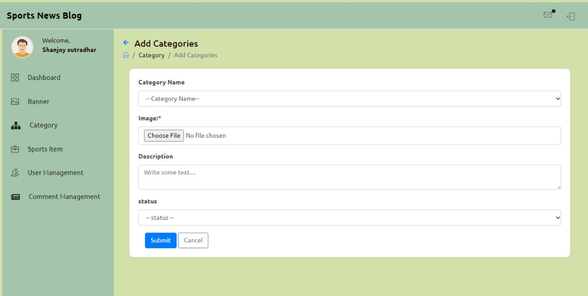

All Category page

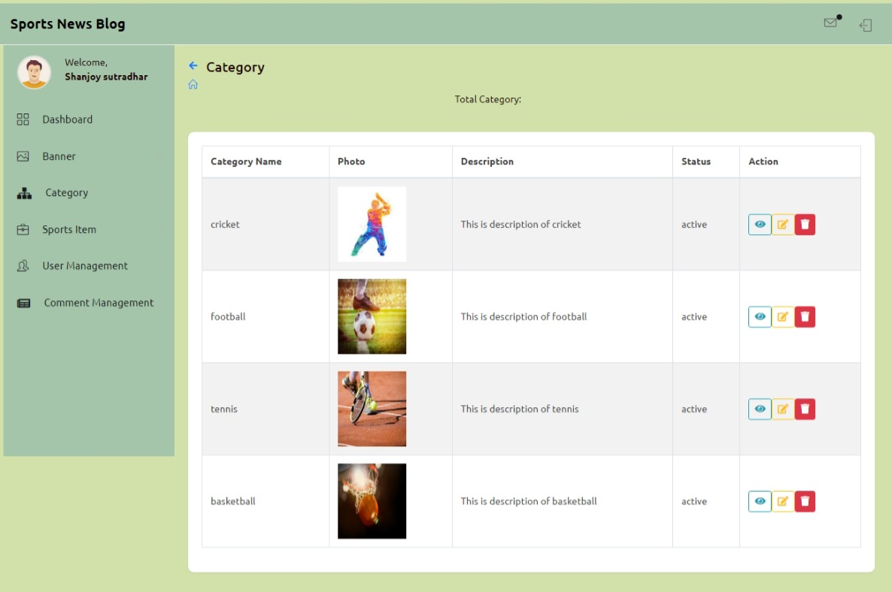

Category edit page

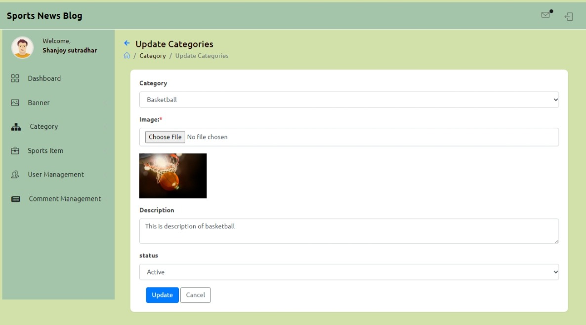

Blog create  page

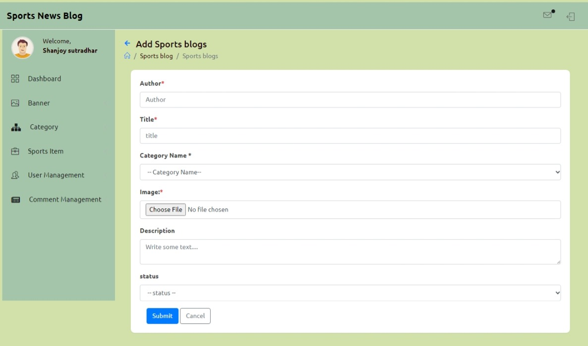

All Blog page

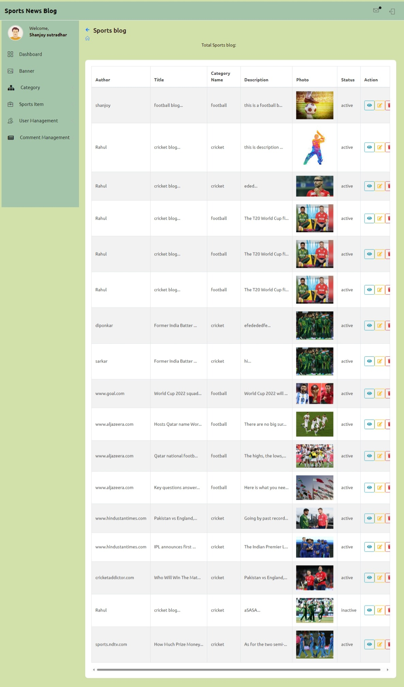

Blog edit page

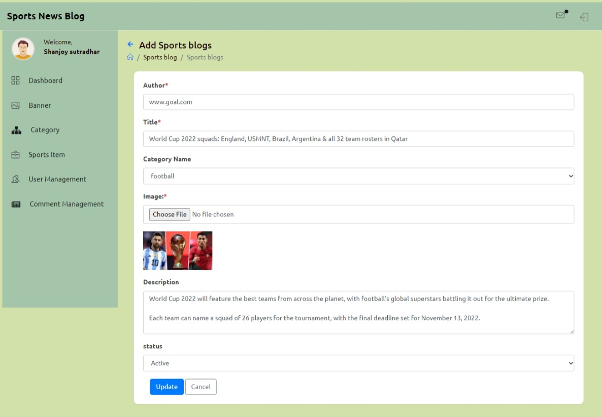

