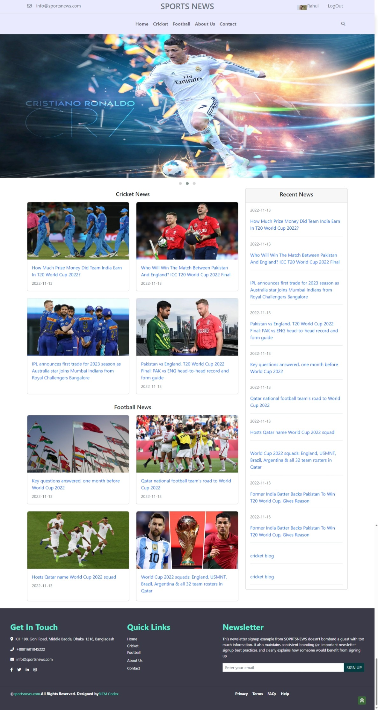
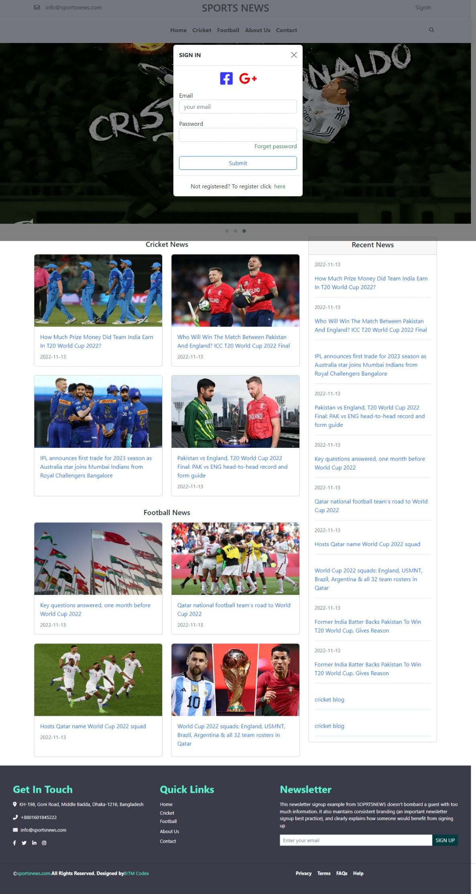

<h1>Welcome to Sports News Website</h1>
live at https://sanjoysutradhar.github.io/sports-news-blog-clone/index.html
<<<<<<< HEAD

=======
>>>>>>> 60a8f887a6eb19bba633fd1664213d759566badd
<h4>This is implemented by fully using php object oriented concept<h4>
<h4>There have Admin Panel And User Panel<h4>

There are Five classes:

<ol>
    <li>Auth(users)</li>
    <li>Blog</li>
    <li>Category</li>
    <li>Comment</li>
    <li>Message</li>
</ol>

Admin role:

<ul>
    <li>CRUD operation of Blogs</li>
    <li>CRUD operation of Categorys</li>
</ul>

Users role:

<ul>
    <li>Create and Update operation of him/her profile</li>
    <li>Create and Update operation of him/her comments in every blogs</li>
    <li>Everyone can send Message to authority</li>
</ul>

<h5>User Panel</h5>

Home page

